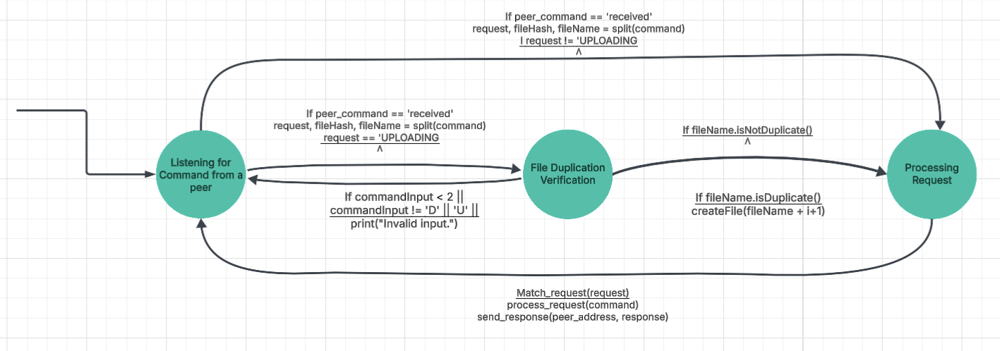
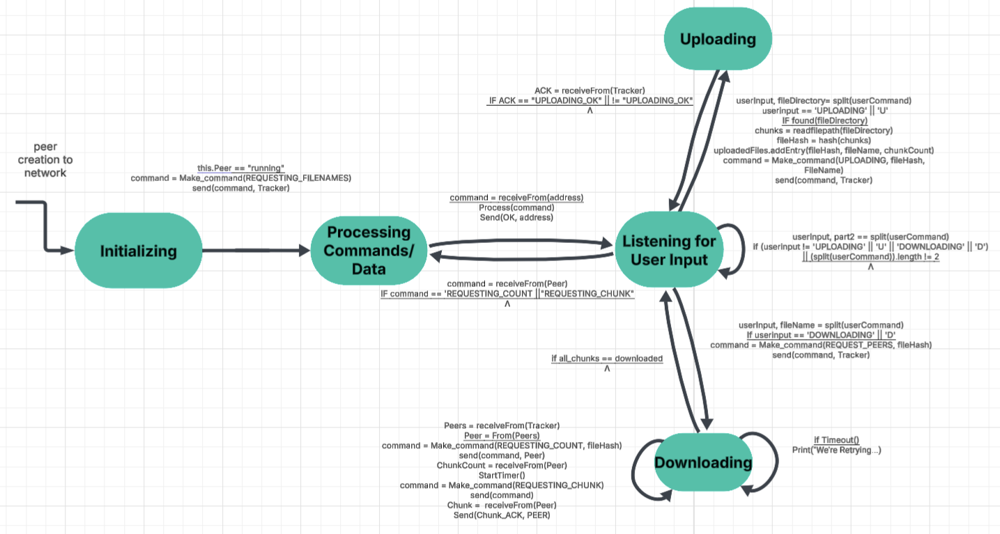

# CompNetworkingProject
**By: Brenda Tavera, Isaac Robinson, Justin Tolbert, and Karon Minor**

## About 

This is a Peer-to-Peer (P2P) network project that serves as an introduction to Computer Networking. The goal is to build a decentralized file-sharing system where peers at DSU can discover each other, establish direct connections, and efficiently transfer files.

We utilize TCP (Transmission Control Protocol) for reliable, connection-oriented peer communication. TCP ensures that data packets arrive in order and without errors, making it ideal for file transfers where data integrity is critical.

We implement core networking concepts such as:

- Socket programming for peer communication
- Peer discovery using a tracker-based approach
- Multi-threading for optimal data transmission
- File integrity verification with hashing and checksums
- Basic authentication for secure connections

This project helps us understand how distributed networks operate, the challenges of real-time communication, and the importance of data integrity in file transfers.

## Protocol diagrams

To get an understanding of how the P2P network works we'll show the protocols at hand that allow for this file synchronization. This consists of two main entities, the Peer and Tracker, that have their own parts. 

The Tracker is the central structure that coordinates the peers within the network by:

- retrieving, storing, and sending metadata about network files to/from peers
- handling requests given by peers (ex. Request Peers...)

The Peer is the role the user will assume when joining the peer so that they can:

- will upload files to their local storage of files and to the tracker.
- send chunks of their original files for other peer's to download.
- Download other's peers files
- Discover new peers 

We will visualize the step by step process of both the Peer and Tracker through finite state machines

### Tracker Finite State Machine

.

**1. Listening**

The tracker goes into an idle state when the network is created, waiting for peers to send commands to it. 

**2. Processing Commands/Data**

The processing of the commands involves the splitting of the command into 3 processable parts. They are the request (instructions), file name, and file hash. The file name and file hash parts are only included in certain requests and can depend on which requests are executed. They are:

-UPLOADING for storing any uploading files
-REQUEST_FILENAME for requesting the name of the files currently stored
-REQUEST_PEERS for requesting peers of a certain file using a file's hash
-REQUEST_HASH for getting the file hash using the file's name

. 

Then processes commands and responds accordingly.

### Peer Finite State Machine

. 

Here is the peer finite state machine diagram that displays its interactions with the tracker and other peers. The key states in this FSM include:

**1. Initializing**

The peer joins the network and sends a request to the tracker for available filenames.

Example command: REQUESTING_FILENAMES

**2. Processing Commands/Data**

The peer listens for responses from the tracker or other peers.

Processes commands and responds accordingly.

Example response: OK after processing a request.

**3. Listening for User Input**

The peer waits for user commands, which may be:

Uploading (UPLOAD or U): Sends a file hash and metadata to the tracker.

Downloading (DOWNLOAD or D): Requests file hashes and sources from the tracker.

**4.  Uploading**

Reads the file, generates a hash, and registers it with the tracker.

Waits for confirmation before completing the upload.

**5. Downloading**

Requests peers that have the file.

Retrieves file chunks and verifies integrity using hashes.

